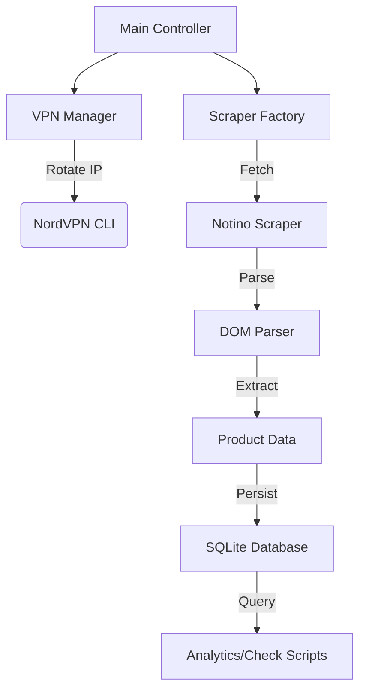

# 💄 Cosmetics Price Tracker & Analytics Engine

> **A high-performance, stealth-optimized scraping pipeline for tracking cosmetic product prices, variants, and historical trends across major Polish e-commerce platforms.**


---

## 📸 Demo


---

## 🚀 Project Overview

In the competitive e-commerce landscape, price fluctuations are rapid and often localized. This project solves the problem of **accurate, historical price tracking** for cosmetic products, specifically adhering to the EU Omnibus Directive (tracking the lowest price in the last 30 days).

Unlike simple scrapers, this system is built for **resilience and stealth**. It autonomously manages network identity via VPN rotation, impersonates real consumer browsers to bypass anti-bot protections, and intelligently parses complex, dynamic product pages (including multi-variant listings).

### Why this exists?

- **Data Accuracy:** To distinguish between "fake" markups and genuine discounts.
- **Compliance Monitoring:** Verifies if vendors are correctly displaying the 30-day minimum price history.
- **Automation:** Replaces manual price checking with a set-and-forget autonomous agent.

---

## ✨ Key Features

- **🛡️ Stealth Impersonation**
  - Utilizes `curl_cffi` to mimic legitimate TLS fingerprints (Chrome/Safari/Firefox) and headers, rendering the scraper indistinguishable from a standard browser.
- **🔄 Autonomous Network Rotation**

  - Integrated **NordVPN Manager** that monitors request volumes and automatically rotates IP addresses randomly between configurable intervals (e.g., every 15-35 requests) to zero-out blocking risk.

- **📦 Intelligent DOM Parsing**

  - **Variant Discovery:** Recursively crawls product variants (different sizes, colors) found on a single landing page.
  - **Omnibus Compliance:** Specifically extracts the legal "lowest price in 30 days" value alongside current shelf prices.
  - **Promotion Logic:** Detects complex promo structures, including "limited time offers" and voucher code requirements.

- **💾 Robust Data Pipeline**
  - **SQLite Architecture:** Normalized database schema separating static product details from time-series price logs.
  - **Unicode Integrity:** Full UTF-8 support ensures accurate handling of special Polish characters (e.g., _pielęgnacja_).
  - **Resiliency:** Built-in retry mechanisms, error logging, and graceful failure handling.

---

## 🛠️ Tech Stack

| Component    | Technology         | Description                                  |
| :----------- | :----------------- | :------------------------------------------- |
| **Core**     | **Python 3.12**    | Primary logic and orchestration.             |
| **Scraping** | **curl_cffi**      | For TLS fingerprinting and HTTP/2 requests.  |
| **Parsing**  | **BeautifulSoup4** | High-speed HTML parsing and DOM traversal.   |
| **Database** | **SQLite3**        | Lightweight, serverless relational database. |
| **Network**  | **NordVPN CLI**    | External tool integration for IP rotation.   |

---

## 🏗️ Architecture Design

The project follows a **modular, service-oriented architecture**:



- **Separation of Concerns:** Scrapers are decoupled from the networking layer and storage logic.
- **Configurable Strategy:** `config.py` acts as a central control plane for request intervals, rotation thresholds, and feature flags.

---

## 💻 Getting Started

### Prerequisites

- Python 3.10+
- NordVPN Account (and CLI installed)

### Installation

1. **Clone the repository**

   ```bash
   git clone https://github.com/yourusername/cosmetics-price-tracker.git
   cd cosmetics-price-tracker
   ```

2. **Install Dependencies**

   ```bash
   pip install -r requirements.txt
   ```

3. **Configuration**
   Edit `config.py` to set your preferences:

   ```python
   USE_NORDVPN = True        # Enable/Disable VPN
   VPN_ROTATE_MIN = 15       # Min requests before rotation
   NOTINO_URL = "..."        # Target Category URL
   ```

4. **Run the Scraper**

   ```bash
   python main.py
   ```

5. **Verify Data**
   Check the populated database:
   ```bash
   python database/check_db.py
   ```

---

## 🗺️ Future Roadmap

- **Dashboard UI:** Build a Streamlit or React frontend to visualize price history charts.
- **Multi-Store Support:** Extend the `BaseScraper` class to support other retailers (Hebe, Rossmann).
- **Price Prediction:** Store AI model to predict future promotion cycles.

---

_Built with ❤️ and Python._
